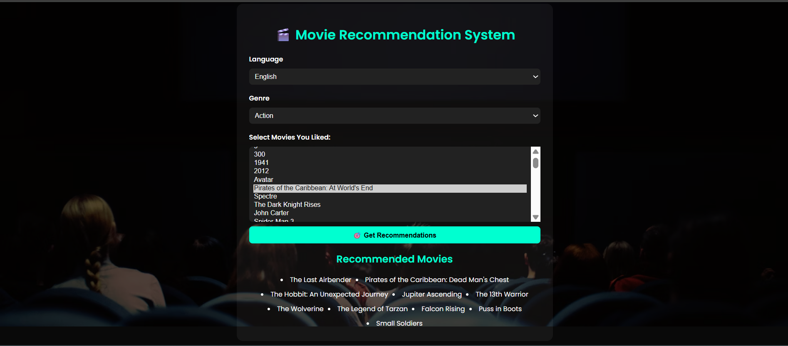

# 🎬 Movie Recommendation System

A smart, interactive movie recommendation system that lets users select language and genre, choose movies they already liked, and receive AI-powered movie recommendations — all on a clean, modern web interface.

> Built using HTML, CSS, JavaScript, and Python (for ML-based preprocessing using the TMDB 5000 Movie Dataset)

---

## 🚀 Features

✅ Select preferred **Language** (e.g., English, Hindi, Telugu)  
✅ Choose a **Genre** (Action, Romance, Sci-Fi, Drama)  
✅ Pick movies you already like  
✅ Instantly get top 10 **recommended movies**  
✅ Clean and responsive **frontend UI**  
✅ Recommendations powered by **content-based filtering**  
✅ ML processing done once; no server or backend needed during runtime

---

## 🛠️ Technologies Used

| Layer       | Tech Stack                          |
|------------|--------------------------------------|
| Frontend   | HTML5, CSS3, JavaScript              |
| ML Backend | Python (pandas, scikit-learn)        |
| Dataset    | TMDB 5000 Movies Dataset from Kaggle |
| Output     | `recommendations.json` (used in frontend) |

---

## 📊 How It Works

1. **Python Script (`generate_recommendations.py`)**  
   - Uses movie `overview` + `genre` as content
   - Calculates cosine similarity between movies
   - Filters recommendations by selected `language + genre`
   - Generates `recommendations.json` with top 10 similar movies per movie

2. **Frontend (`index.html`, `style.css`, `script.js`)**  
   - User selects language + genre
   - Chooses movies they liked from dropdown
   - JS shows top 10 recommended titles using the JSON data

---

## 📸 Demo

## 📁 Folder Structure

movie-recommendation-system/
│
├── index.html # Main web page
├── style.css # Styling
├── script.js # Frontend logic
├── recommendations.json # Precomputed movie recommendations
├── generate_recommendations.py # Python ML script
└── README.md # Project documentation

## 📦 Dataset

Used the [TMDB 5000 Movie Dataset](https://www.kaggle.com/datasets/tmdb/tmdb-movie-metadata) from Kaggle.

- Includes movie titles, genres, language, and overviews
- Used for generating similarity-based recommendations

## 👩‍💻 Author

**Varshini Yerlanki**  
B.Tech CSE, VIT (2022–2026)  
University 3rd Rank Holder  
📧 yerlankivarshini@gmail.comw 
🔗 [LinkedIn](https://www.linkedin.com/in/varshini-yerlanki-a95698293) | [GitHub](https://github.com/Varshini-966)

